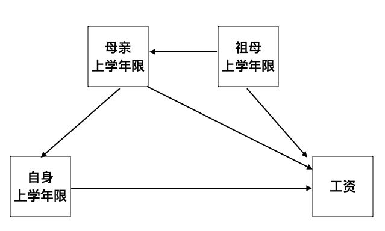

注：下文是我在知乎的回答。原链接：<https://www.zhihu.com/question/326199739/answer/710278097>

\\
题主似乎问了两个问题。

1.  回归中，自变量 X 和控制变量 Z 的地位应该是平等/对称的，为什么解释起来不一样？
2.  回归系数的解释总是说「保持 Z 不变，1 个单位的 X 增加和 betaX 个单位的 y 增加相关联」，为什么回归系数能保持 Z 不变，原理是什么？

**第一个问题**，自变量 X 和控制变量 Z 在 OLS 算法的眼里确实是一样的，所以回归系数的机械解释也是一样的。假设我们的线性回归模型是 y = beta0 + betaX * X + betaZ * Z + u，其中 y 是年工资 (元），X 是上学年限（年），Z 是母亲上学年限（年）。betaX 和 betaZ 分别是 X 和 Z 的回归系数。

- betaX 的解释是「如果母亲上学年限一样，平均来讲，多上一年学的小明比少上一年学的小红每年多赚 betaX 元」。
- betaZ 的解释是「如果小明和小红的上学年限一样，但小明的妈妈比小红的妈妈多上一年学，平均来讲，小明的年工资比小红多 betaZ 元」。

在这个意义上，「自变量」和「控制变量」只不过是「感兴趣变量」和「不怎么感兴趣变量」的不同标签。

但上面的解释只是相关性，一旦涉及到因果解释，就要用到现实世界的因果模型，betaX 和 betaZ 的解释就不一样了。假设我们确信真实的因果模型如下图所示：

- 自身的上学年限会影响自身的工资
- 母亲的上学年限会影响子女的上学年限，也会以除了子女教育以外的其他方式影响子女的收入（比如受教育程度高的母亲可能会更有意识的培养子女的软技能，从而影响子女工资）
- 祖母的上学年限会影响母亲的上学年限，也会以其他方式影响孙子孙女的工资（比如受教育程度高的祖母可能有更广的人脉，从而影响孙子孙女的工作和工资）

在这个因果模型下，咱们的回归模型 y = beta0 + betaX * X + betaZ * Z + u 中 betaX 是因果解释：给定母亲的上学年限相同，平均来讲，每多上一年学能增加工资 betaX。这是因为加了母亲上学年限 Z 之后，X 和 u 就不相关了, E (Xu \| Z) = 0，所以 betaX 是无偏的。而 betaZ 就只能是相关解释：我们不能说母亲每多上一年学，就能增加子女的工资 betaZ，只能说母亲的教育水平和子女的工资是正相关的（conditional on 子女的受教育水平），这是因为祖母上学年限在 u 里面，所以 Z 与 u 是相关的，E(Zu \| X) != 0，betaZ 是有偏的。

许多研究中，希望得到因果解释的那个变量就是「自变量」，而其他变量只是帮助自变量得到因果解释。所以控制变量有时候也被叫做 nuisance variable.

**第二个问题**，回归系数的解释总是说「保持 Z 不变，1 个单位的 X 增加和 betaX 个单位的 y 增加相关联」，为什么回归系数能保持 Z 不变，原理是什么？

这个「保持 Z 不变」或者「控制 Z 在相同水平」的说法是从早期用回归分析实验的时候遗留下来的，适用于实验数据，并不适合观察数据。因为在实验中，你确实可以控制一个变量在不同个体之间不变，在观察数据中做不到。用观察数据做回归得出的回归系数，是平均上面再叠加平均，强行用「保持 Z 不变」来解释结果就很勉强。所以 Andrew Gelman 就建议不要用 control for Z，而是 (attempt to) adjust for Z. 「控制变量」(control variable) 叫做 「协变量」(covariate) 可能更恰当。

至于回归是怎么 adjust for Z 的，参考其他几个答案。另外，Frisch–Waugh–Lovell theorem 了解一下，对理解最小方差回归的原理有帮助。沿用上面的例子简单说，就是把工资和自身上学年限中受到母亲教育影响的部分剔除，用剩下的部分做简单的相关分析。这个时候工资和上学年限的关系就不再受到母亲教育程度的影响，在这个意义上母亲教育程度的影响被「控制」住了。